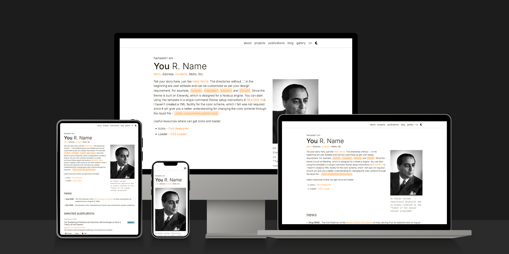
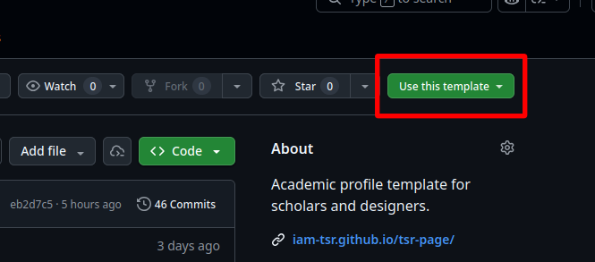

<div align="center">

# tsr-page



**A minimal, modern academic profile template for scholars and designers.**
**Powered by [Eleventy](https://www.11ty.dev/) — zero-config, fast, and easy to customize.**

<br>

[Live Demo](https://iam-tsr.github.io/tsr-page/) · [Report Bug](https://github.com/iam-tsr/tsr-page/issues) · [Request Feature](https://github.com/iam-tsr/tsr-page/issues)

<br>


[](https://github.com/iam-tsr/tsr-page/actions/workflows/deploy.yml)
[](https://github.com/iam-tsr/tsr-page/blob/main/LICENSE)

</div>

---

## Table of Contents

- [About](#about)
- [Features](#features)
- [Preview](#preview)
- [Getting Started](#getting-started)
- [Project Structure](#project-structure)
- [Customization](#customization)
- [Deployment](#deployment)
- [License](#license)
- [Acknowledgements](#acknowledgements)

## About

**tsr-page** is a ready-to-use academic portfolio template built with [Eleventy](https://www.11ty.dev/). It provides a clean, responsive layout for showcasing your research, projects, publications, blog posts, and artwork — all configurable through simple YAML and Markdown files.

## Features

- **Pre-built pages** — About, Projects, Publications, Blog, Gallery, and CV
- **Dark / Light theme** — toggle with one click; respects user preference
- **Blog with Markdown** — write posts in `.md` with full Markdown-it + KaTeX math support
- **YAML-driven content** — update your data in `site.yml` and `metadata/` — no template editing needed
- **Responsive design** — mobile-first layout with hamburger navigation
- **Custom loader animation** — configurable loading screen via `site.yml`
- **GitHub Pages ready** — ships with a deploy workflow out of the box
- **Minimal dependencies** — only Eleventy, Markdown-it, and KaTeX

## Preview

| Desktop | Tablet |
|:---:|:---:|
|  |  |

## Getting Started

### Prerequisites

| Tool | Version |
|------|---------|
| Node.js | `>= 18.0.0` |
| npm | `>= 8.11.0` |

### Installation

1. **Use this template** — click the **Use this template** button on GitHub (or import the repo).

   

2. **Clone your new repo**

   ```bash
   git clone https://github.com/<your-username>/<your-repo>.git
   cd <your-repo>
   ```

3. **Install dependencies**

   ```bash
   npm ci
   ```

4. **Start the dev server**

   ```bash
   npm run dev
   ```

   The site will be available at `http://localhost:8080`.

## Project Structure

```
├── _layout/              # Nunjucks layouts & components
│   ├── base.njk
│   └── _components/      # navbar, footer, head
│       └── _content/     # page-level templates
├── _scripts/             # Client-side JS (theme, gallery, etc.)
├── _style/               # Liquid-processed CSS per page
├── assets/               # Static assets (images, CV PDF)
├── content/              # Markdown content (about, blog posts)
├── metadata/             # YAML data files per page
├── site.yml              # Global site configuration
├── eleventy.config.js    # Eleventy configuration
└── package.json
```

## Customization

All user-facing content lives in **three places**:

| What | Where | Format |
|------|-------|--------|
| Site info, pages, contacts, theme | `site.yml` | YAML |
| Page data (projects, publications, gallery, blog list) | `metadata/*.yml` | YAML |
| Long-form content (about bio, blog posts) | `content/**/*.md` | Markdown |

Refer to the [live demo's about page](https://iam-tsr.github.io/tsr-page/) for detailed editing instructions.

## Deployment

The template includes a GitHub Actions workflow for **GitHub Pages**:

1. Push your changes to `main`.
2. In your repo settings, set **Pages → Source** to **GitHub Actions**.
3. The site deploys automatically on every push.

To build manually:

```bash
npm run build
```

Output is generated in the `_site/` directory.

## License

Distributed under the **MIT License**. See [LICENSE](LICENSE) for details.

## Acknowledgements

- [Eleventy](https://www.11ty.dev/) — static site generator
- [al-folio](https://github.com/alshedivat/al-folio) — original inspiration
- [KaTeX](https://katex.org/) — math typesetting
- [Font Awesome](https://fontawesome.com/) — icons
- [Unsplash](https://unsplash.com/) — stock photos